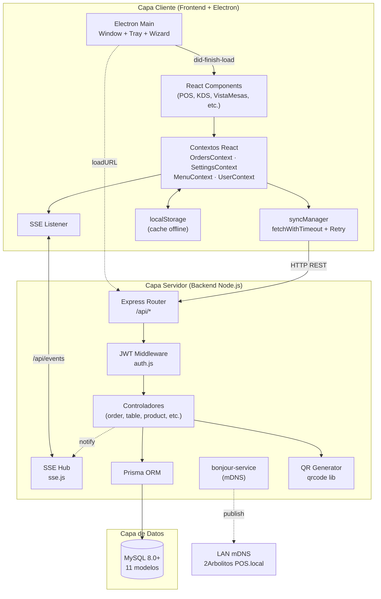

# 04 — Arquitectura del Sistema

## 4.1 Visión General

2Arbolitos sigue una **arquitectura de tres capas** clásica (presentación, lógica de negocio, datos) con elementos modernos: **sincronización reactiva cliente-servidor** vía Server-Sent Events, **empaquetado de escritorio** con Electron, y **descubrimiento de red** mediante mDNS.

```
┌────────────────────────────────────────────────────────────────────┐
│              CAPA DE PRESENTACIÓN (FRONTEND + ELECTRON)            │
│  ┌──────────────┐  ┌──────────────┐  ┌──────────────┐  ┌─────────┐ │
│  │  React 19    │  │  Tailwind 4  │  │  Vite 7 PWA  │  │Electron │ │
│  │  Componentes │  │  Diseño      │  │  Workbox SW  │  │  Tray   │ │
│  └──────────────┘  └──────────────┘  └──────────────┘  └─────────┘ │
│                                                                    │
│  Contexto global: OrdersContext · SettingsContext · MenuContext   │
│  Cliente HTTP: fetchWithTimeout + retry + debounce                │
└─────────────────────────┬──────────────────────────────────────────┘
                          │ HTTP/REST + SSE  (LAN)
┌─────────────────────────┴──────────────────────────────────────────┐
│              CAPA DE LÓGICA DE NEGOCIO (BACKEND)                   │
│  ┌──────────────┐  ┌──────────────┐  ┌──────────────┐  ┌─────────┐ │
│  │  Express 4   │  │  JWT Auth    │  │  Controlador │  │  SSE    │ │
│  │  Router      │  │  Middleware  │  │  es          │  │  Hub    │ │
│  └──────────────┘  └──────────────┘  └──────────────┘  └─────────┘ │
│                                                                    │
│  Reglas de negocio: Versionado, conflict-merge, multi-moneda,     │
│  cálculo de vueltos, cierres de caja, gastos operativos.          │
└─────────────────────────┬──────────────────────────────────────────┘
                          │ Prisma ORM  (TCP 3306)
┌─────────────────────────┴──────────────────────────────────────────┐
│              CAPA DE DATOS (PERSISTENCIA)                          │
│  ┌──────────────────────────────────────────────────────────────┐  │
│  │              MySQL 8.0+                                     │  │
│  │  Tablas: users · categories · products · tables ·           │  │
│  │  table_states · orders · order_items · payments ·           │  │
│  │  settings · closures · expenses                             │  │
│  └──────────────────────────────────────────────────────────────┘  │
└────────────────────────────────────────────────────────────────────┘
```

## 4.2 Diagrama de Componentes



## 4.3 Patrones Arquitectónicos Aplicados

### 4.3.1 Offline-First con Sincronización Reactiva

```
        ┌────────────────────────────────────┐
        │   Usuario interactúa con UI        │
        └─────────────┬──────────────────────┘
                      ▼
        ┌────────────────────────────────────┐
        │  Estado local (activeTables)       │
        │  + persistencia en localStorage    │
        └─────────────┬──────────────────────┘
                      ▼ debounce(300ms)
        ┌────────────────────────────────────┐
        │  fetchWithTimeout(10s)             │
        │  + retry exponencial 5x            │
        │  + backoff [1,2,4,8,15]s           │
        └─────────────┬──────────────────────┘
                      ▼
        ┌────────────────────────────────────┐
        │  PUT /api/tables/state             │
        │  {tableId, items, _clientVersion}  │
        └─────────────┬──────────────────────┘
                      ▼
        ┌────────────────────────────────────┐
        │  Servidor: validar versión         │
        │  • OK → versión++ → notifySSE      │
        │  • Conflicto → merge + SSE         │
        └─────────────┬──────────────────────┘
                      ▼
        ┌────────────────────────────────────┐
        │  SSE broadcast a todos los clientes│
        │  → actualización reactiva          │
        └────────────────────────────────────┘
```

### 4.3.2 Server-Sent Events como Bus de Eventos

El servidor mantiene un `Map<clientId, res>` en `sse.js`. Los controladores invocan `notifySSEClients(eventType, payload)` después de operaciones que afectan a otros clientes. Cada cliente abre una conexión persistente a `/api/events` que recibe eventos hasta cerrar la pestaña o desconectarse.

```javascript
// Cliente (OrdersContext.jsx)
const eventSource = new EventSource('/api/events');
eventSource.addEventListener('order:created', (e) => {
  const order = JSON.parse(e.data);
  setOrders(prev => [order, ...prev]);
});

// Servidor (sse.js)
export function notifySSEClients(type, payload) {
  for (const [id, res] of clients) {
    res.write(`event: ${type}\ndata: ${JSON.stringify(payload)}\n\n`);
  }
}
```

### 4.3.3 Versionado Optimista y Conflict-Merge

El modelo `TableState` tiene un campo `versión Int @default(0)`. En cada escritura:

1. Cliente envía `{ items, _clientVersion: N }`.
2. Servidor lee `versión` actual: `serverVersion`.
3. Si `serverVersion > N` → **conflicto**:
   - Servidor devuelve `{ conflict: true, serverData, serverVersion }`.
   - Cliente merge: toma serverData y agrega items locales únicos por `product.id`.
   - Cliente reenvía con nueva versión.
4. Si `serverVersion == N` → **ok**:
   - Servidor actualiza con `versión: N+1`.
   - Devuelve `{ versión: N+1 }`.
   - Notifica vía SSE a otros clientes.

### 4.3.4 Multi-tenancy de Red (No es multi-negocio)

Un único servidor Express sirve un único restaurante. Sin embargo, sirve **múltiples clientes** (PCs, tablets, celulares) que comparten la misma base de datos. La "multi-tenancy" aquí es de dispositivos, no de negocios.

## 4.4 Decisiones de Diseño Clave

| Decisión | Alternativa | Justificación |
|:---------|:------------|:--------------|
| MySQL | PostgreSQL, SQLite | Madurez, conocimiento local, mejor para lecturas intensivas |
| Prisma ORM | Sequelize, Knex, raw SQL | Type-safety, schema declarativo, migraciones automáticas |
| Express | Fastify, Koa, NestJS | Madurez, ecosistema de middleware, simplicidad |
| SSE | WebSockets, Long Polling | Más simple cuando solo es servidor→cliente |
| JWT | Sesiones en servidor | Stateless, escala horizontal, mismo código en LAN/WAN |
| Electron | Tauri, app nativa | Ecosistema JS completo, no requiere Rust |
| React 19 | Vue, Svelte, Angular | Ecosistema, contratación, conocimiento del equipo |
| Tailwind 4 | CSS-in-JS, CSS modules | Velocidad de desarrollo, bundle pequeño |
| localStorage | IndexedDB | Suficiente para el volumen de datos, API sincrónica |
| bonjour-service | IP estática, DHCP | mDNS evita config manual, ideal para PyMEs |

## 4.5 Capas de Seguridad

```
┌─────────────────────────────────────────────────────────┐
│ 1. Capa de Transporte                                    │
│    • HTTP en LAN (sin TLS — red privada)                │
│    • CORS whitelist: localhost, 127.0.0.1,              │
│      192.168.x.x, 10.x.x.x                              │
└─────────────────────────────────────────────────────────┘
┌─────────────────────────────────────────────────────────┐
│ 2. Capa de Autenticación                                 │
│    • JWT firmado con HS256, expiración 7 días           │
│    • bcrypt para passwords (10 rounds)                  │
│    • Middleware auth.js válida Bearer token            │
└─────────────────────────────────────────────────────────┘
┌─────────────────────────────────────────────────────────┐
│ 3. Capa de Autorización                                  │
│    • Roles: ADMIN, WAITER, COOK, CASHIER                │
│    • Validación por endpoint (a implementar)            │
│    • UserContext válida sesión activa                   │
└─────────────────────────────────────────────────────────┘
┌─────────────────────────────────────────────────────────┐
│ 4. Capa de Validación de Datos                           │
│    • Prisma genera queries parametrizadas (no SQLi)     │
│    • Validaciones en controladores                      │
│    • express.json() limita payload                      │
└─────────────────────────────────────────────────────────┘
```

## 4.6 Modelo de Despliegue

El sistema se distribuye de **dos formas complementarias**:

1. **Como app de escritorio empaquetada** (`.exe`, `.dmg`, `.AppImage`): todo-en-uno, ideal para el PC servidor.
2. **Como acceso web en LAN**: los clientes (tablets, celulares) abren el navegador y navegan a `http://<ip-servidor>:3002`.

Ambas formas ejecutan el **mismo binario / bundle de archivos**: el servidor Express sirve el frontend compilado (`dist/`) en la misma URL.

## 4.7 Conclusión Arquitectónica

La arquitectura de 2Arbolitos está diseñada para **resiliencia, simplicidad operativa y bajo costo**:

- **Resiliencia**: offline-first, versionado optimista, SSE reconecta automáticamente, Electron puede reiniciar el servidor si detecta caída.
- **Simplicidad operativa**: un único proceso servidor, una única base de datos, sin microservicios, sin Kubernetes. Un técnico de soporte puede instalarlo en 1 hora.
- **Bajo costo**: hardware commodity (cualquier PC moderna), MySQL gratis, Node.js gratis, sin costos de nube.

Esta arquitectura no es la más escalable del mundo, pero es **la correcta para el problema**: un restaurante con 5-20 dispositivos en una LAN, donde la latencia debe ser mínima y la disponibilidad máxima, sin dependencia de internet.
