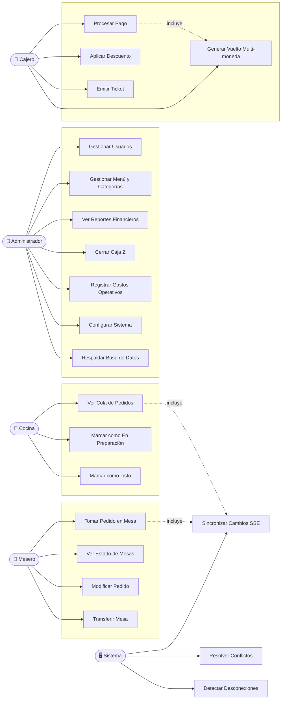
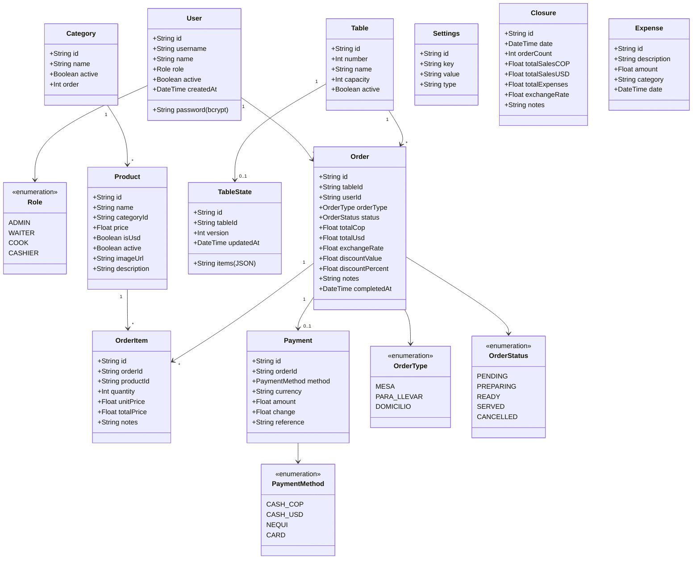
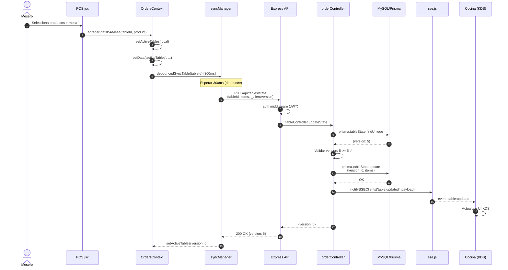
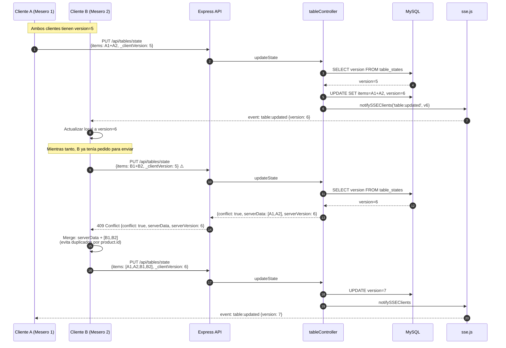
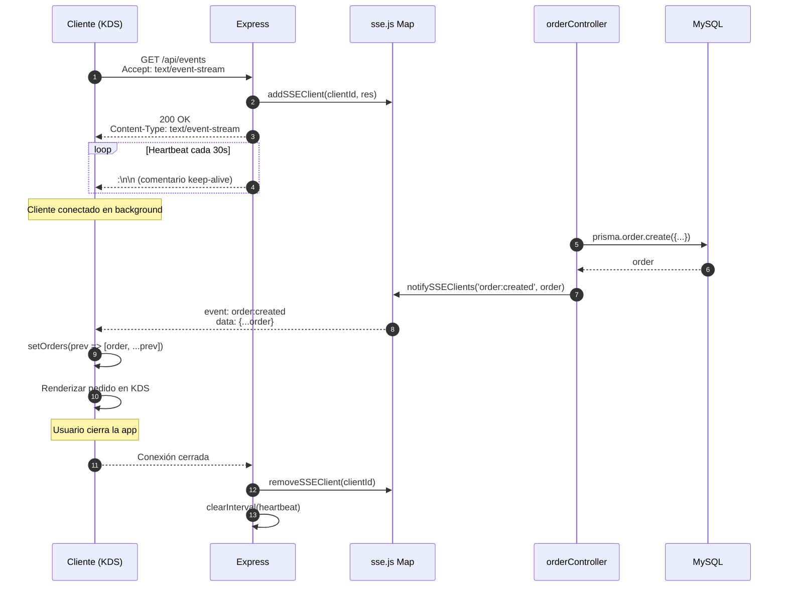
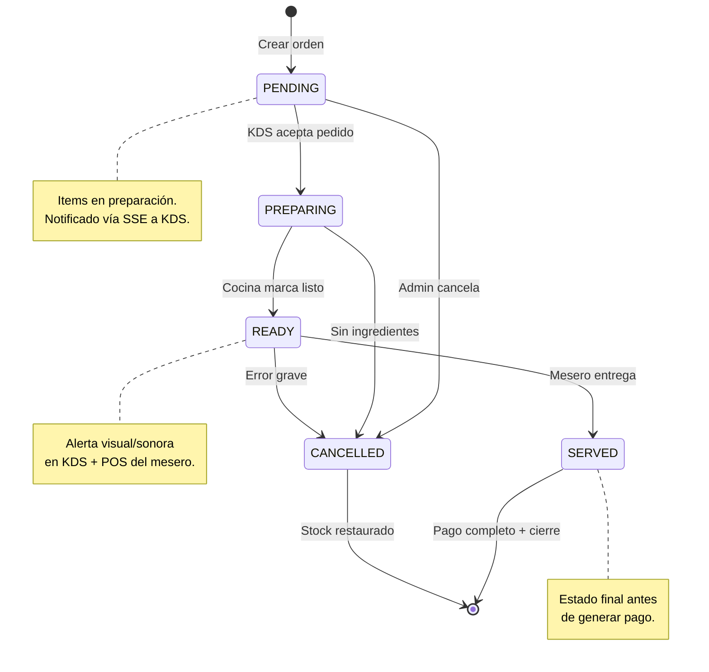
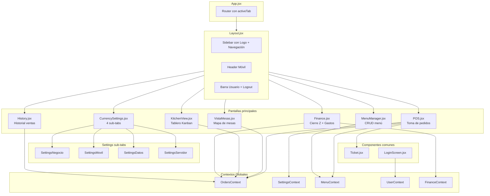
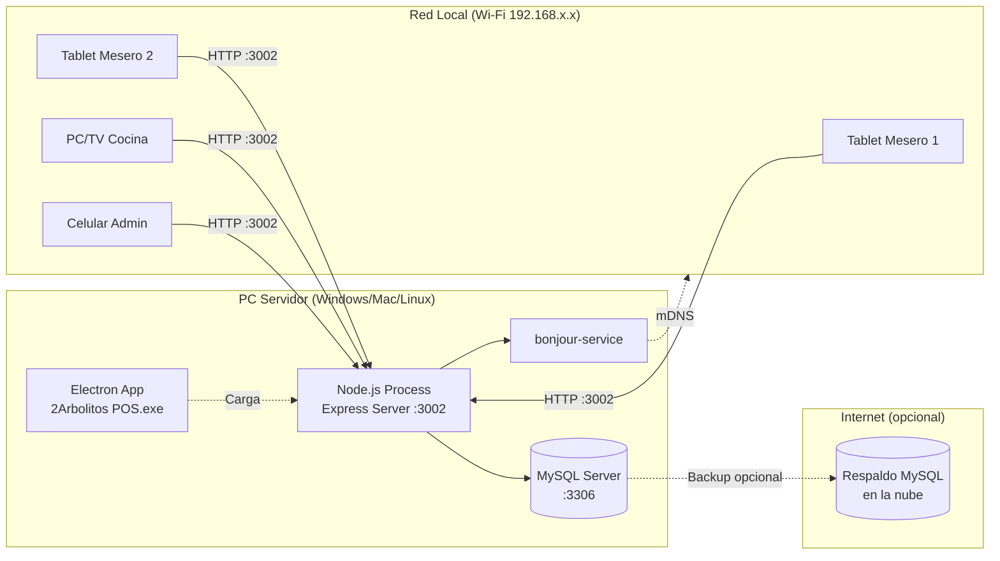

# 05 — Diagramas UML

Este capítulo presenta los diagramas UML que modelan el sistema 2Arbolitos. Todos los diagramas están escritos en sintaxis Mermaid y se renderizan automáticamente en GitHub, VS Code y la mayoría de visores Markdown modernos.

## 5.1 Diagrama de Casos de Uso

Los casos de uso están agrupados por actor (rol de usuario).

## 5.2 Diagrama de Clases (Modelo de Dominio)

## 5.3 Diagrama de Secuencia: Crear Orden Completa

## 5.4 Diagrama de Secuencia: Resolución de Conflicto (Versionado)

## 5.5 Diagrama de Secuencia: Comunicación SSE Tiempo Real

## 5.6 Diagrama de Actividad: Proceso Completo de Venta

```mermaid
stateDiagram-v2
    [*] --> SesionIniciada: Login

    SesionIniciada --> SeleccionMesa: Elegir mesa o Para Llevar

    state "Selección de Productos" as SP {
        [*] --> BuscarProductos
        BuscarProductos --> FiltrarCategoria
        FiltrarCategoria --> AgregarCarrito
        AgregarCarrito --> BuscarProductos: Continuar
        AgregarCarrito --> [*]: Ir a cobrar
    }

    SeleccionMesa --> SP
    SP --> ConfirmarOrden: Revisar pedido
    ConfirmarOrden --> SP: Agregar más
    ConfirmarOrden --> EnviarACocina: Confirmar

    EnviarACocina --> CocinaPreparando: Order status PENDING
    CocinaPreparando --> CocinaLista: status READY
    CocinaLista --> ServidoAlCliente: status SERVED

    ServidoAlCliente --> ProcesoPago: Generar cuenta
    ProcesoPago --> SeleccionMetodo: Elegir pago

    state "Cálculo de Vuelto" as CV {
        [*] --> IngresarEfectivo
        IngresarEfectivo --> CalcularVuelto
        CalcularVuelto --> Suficiente: OK
        CalcularVuelto --> IngresarEfectivo: Falta
        Suficiente --> [*]
    }

    SeleccionMetodo --> CV
    CV --> AplicarDescuento: Opcional
    AplicarDescuento --> GenerarTicket

    state "Pago Electrónico" as PE {
        [*] --> IngresarReferencia
        IngresarReferencia --> ValidarPago
        ValidarPago --> [*]
    }

    CV --> PE: Nequi/Tarjeta
    PE --> GenerarTicket

    GenerarTicket --> CierreVenta: Imprimir/Email
    CierreVenta --> MesaLiberada: status=SERVED + pago OK
    MesaLiberada --> [*]

    GenerarTicket --> CancelarVenta: Cliente desiste
    CancelarVenta --> [*]
```

## 5.7 Diagrama de Estados: Ciclo de Vida de una Orden

## 5.8 Diagrama de Componentes: Estructura Frontend

## 5.9 Diagrama de Despliegue (simplificado)

## 5.10 Conclusión

Los diagramas UML presentados modelan el sistema desde múltiples perspectivas:

- **Casos de uso**: qué hace cada actor.
- **Clases**: estructura de datos y relaciones.
- **Secuencia**: cómo colaboran los componentes en escenarios clave.
- **Actividad**: flujo del proceso de negocio principal.
- **Estados**: ciclo de vida de las órdenes.
- **Componentes y despliegue**: estructura física y lógica.

Estos diagramas son **vivos**: se actualizan cuando el código cambia, evitando la degradación típica de la documentación estática.
