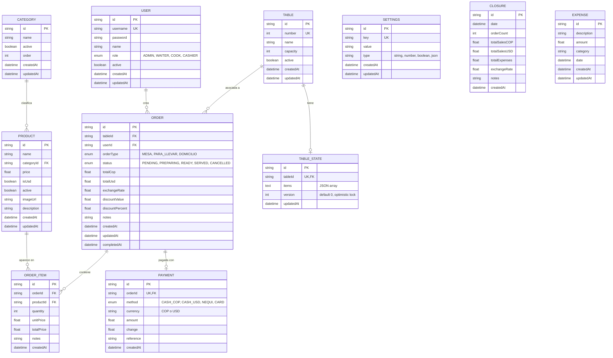

# 06 — Base de Datos

## 6.1 Visión General

2Arbolitos utiliza **MySQL 8.0+** como motor de base de datos relacional, accedido mediante **Prisma ORM 5.22**. El esquema se define declarativamente en `server/prisma/schema.prisma` y contiene **11 modelos** y **4 enums**.

Las decisiones clave del modelo de datos son:

- **Versionado optimista** en `TableState` con campo `version Int @default(0)`.
- **Items de mesa almacenados como JSON** en `TableState.items` (campo `LongText`) — el carrito activo de cada mesa.
- **Relaciones explícitas** con `onDelete: Cascade` donde tiene sentido (items de orden, pagos).
- **Soft-delete** mediante `active Boolean` en `Category`, `Product`, `Table`, `User` — permite "desactivar" sin perder histórico.

## 6.2 Diagrama Entidad-Relación



## 6.3 Explicación de los Modelos

### 6.3.1 User (Usuarios del Sistema)

Representa a cada persona con credenciales de acceso.

| Campo | Tipo | Descripción |
|:------|:-----|:------------|
| `id` | UUID | Identificador único universal |
| `username` | String unique | Nombre de usuario para login |
| `password` | String | Hash bcrypt (10 rounds) |
| `name` | String | Nombre completo mostrado en UI |
| `role` | Enum (Role) | ADMIN, WAITER, COOK, CASHIER |
| `active` | Boolean | Soft-delete: usuarios inactivos no pueden login |

**Reglas de negocio:**
- Username único en todo el sistema.
- Password nunca se devuelve al frontend (omitido en queries con `select`).
- Al desactivar un usuario, sus órdenes históricas se conservan.

### 6.3.2 Category (Categorías del Menú)

Agrupa productos (ej: "Bebidas", "Platos Principales", "Postres").

| Campo | Tipo | Descripción |
|:------|:-----|:------------|
| `id` | UUID | Identificador |
| `name` | String | Nombre mostrado |
| `active` | Boolean | Soft-delete |
| `order` | Int | Orden de aparición (0 = primera) |

**Relación**: 1 Category → N Products (cascade al eliminar).

### 6.3.3 Product (Productos del Menú)

Items vendibles.

| Campo | Tipo | Descripción |
|:------|:-----|:------------|
| `price` | Float | Precio en la moneda indicada por `isUsd` |
| `isUsd` | Boolean | Si es true, precio en USD; si es false, en COP |
| `imageUrl` | String? | URL opcional a imagen del producto |
| `description` | String? | Descripción para el menú digital |

**Nota sobre moneda**: cada producto tiene un precio en su moneda. El sistema convierte a la otra moneda usando `Settings.exchangeRate`. Esto evita doble mantenimiento y errores de redondeo.

### 6.3.4 Table (Mesas Físicas del Restaurante)

Mesas físicas del salón.

| Campo | Tipo | Descripción |
|:------|:-----|:------------|
| `number` | Int unique | Número visible en la mesa (1, 2, 3...) |
| `name` | String? | Alias opcional ("Mesa VIP", "Patio") |
| `capacity` | Int | Capacidad de personas (default 4) |

### 6.3.5 TableState (Estado Activo de Mesa) — **Modelo Clave**

Almacena el carrito activo de cada mesa: qué items tiene pendientes, en qué versión.

| Campo | Tipo | Descripción |
|:------|:-----|:------------|
| `tableId` | String unique | 1:1 con Table |
| `items` | LongText (JSON) | Array de items del carrito |
| `version` | Int default 0 | **Versionado optimista** |
| `updatedAt` | DateTime | Última modificación |

**Estructura típica de `items`:**

```json
[
  {
    "product": {
      "id": "uuid",
      "name": "Hamburguesa",
      "price": 18000,
      "isUsd": false
    },
    "quantity": 2,
    "notes": "Sin cebolla"
  }
]
```

**¿Por qué JSON y no una tabla `cart_items`?**

- Acceso O(1) en lectura/escritura (un solo SELECT/UPDATE por mesa).
- El carrito es volátil: se "consolida" en una `Order` al cobrar.
- Reduce JOIN complexity en el endpoint caliente `/tables/state`.
- El historial completo queda en `Order` + `OrderItem` (relacional).

### 6.3.6 Order (Órdenes / Pedidos)

Representa un pedido consolidado (después de cobrar o enviar a cocina).

| Campo | Tipo | Descripción |
|:------|:-----|:------------|
| `orderType` | Enum | MESA, PARA_LLEVAR, DOMICILIO |
| `status` | Enum | PENDING, PREPARING, READY, SERVED, CANCELLED |
| `totalCop` | Float | Total en pesos colombianos |
| `totalUsd` | Float | Total en dólares |
| `exchangeRate` | Float | Tasa usada al crear la orden (snapshot) |
| `discountValue` | Float | Descuento en valor absoluto |
| `discountPercent` | Float | Descuento porcentual |

**Importante**: `exchangeRate` se **congela en cada orden** para que cambios en la tasa no afecten órdenes históricas.

### 6.3.7 OrderItem (Líneas de Pedido)

| Campo | Tipo | Descripción |
|:------|:-----|:------------|
| `orderId` | FK | Relación con Order |
| `productId` | FK? | Producto (puede ser null si se elimina) |
| `quantity` | Int | Cantidad pedida |
| `unitPrice` | Float | Precio al momento de pedir |
| `totalPrice` | Float | `quantity * unitPrice` (denormalizado para reports) |

**Cascade delete**: si se elimina la Order, sus items se eliminan automáticamente.

### 6.3.8 Payment (Pagos)

| Campo | Tipo | Descripción |
|:------|:-----|:------------|
| `method` | Enum | CASH_COP, CASH_USD, NEQUI, CARD |
| `currency` | String | "COP" o "USD" |
| `amount` | Float | Monto recibido |
| `change` | Float | Vuelto entregado |
| `reference` | String? | Referencia para Nequi/Card |

**Relación 1:1 con Order**: una orden tiene máximo un pago (extensible a pagos parciales en el futuro).

### 6.3.9 Settings (Configuración Global)

Almacén clave-valor para parámetros del sistema.

| Key típico | Tipo | Descripción |
|:-----------|:-----|:------------|
| `exchangeRate` | number | Tasa COP/USD actual |
| `businessName` | string | Nombre del restaurante |
| `businessAddress` | string | Dirección fiscal |
| `businessPhone` | string | Teléfono |
| `businessLogo` | string | URL del logo |
| `autoStart` | boolean | Auto-start con el sistema |
| `taxRate` | number | Porcentaje de impuesto (futuro) |

### 6.3.10 Closure (Cierres de Caja / Reporte Z)

Snapshot al final de un turno o día.

| Campo | Tipo | Descripción |
|:------|:-----|:------------|
| `orderCount` | Int | Total de órdenes del período |
| `totalSalesCOP` | Float | Suma de ventas en pesos |
| `totalSalesUSD` | Float | Suma de ventas en dólares |
| `totalExpenses` | Float | Gastos operativos restados |
| `exchangeRate` | Float | Tasa usada en el cierre |

### 6.3.11 Expense (Gastos Operativos)

Gastos no relacionados con ventas (insumos, servicios, mantenimiento).

| Campo | Tipo | Descripción |
|:------|:-----|:------------|
| `category` | String | "Insumos", "Servicios", "Nómina", "Otros" |
| `date` | DateTime | Cuándo se incurrió |

## 6.4 Enumeraciones (Enums)

### Role

```prisma
enum Role {
  ADMIN
  WAITER
  COOK
  CASHIER
}
```

### OrderType

```prisma
enum OrderType {
  MESA        // Consumo en local
  PARA_LLEVAR // Take-away
  DOMICILIO   // Delivery
}
```

### OrderStatus

```prisma
enum OrderStatus {
  PENDING    // Creada, no enviada a cocina
  PREPARING  // En preparación en cocina
  READY      // Lista para entregar
  SERVED     // Entregada al cliente
  CANCELLED  // Cancelada
}
```

### PaymentMethod

```prisma
enum PaymentMethod {
  CASH_COP  // Efectivo pesos
  CASH_USD  // Efectivo dólares
  NEQUI     // Transferencia Nequi
  CARD      // Tarjeta (datáfono)
}
```

## 6.5 Versionado Optimista — Detalle Técnico

El campo `version` en `TableState` es el corazón de la consistencia distribuida.

```javascript
// Servidor: PUT /api/tables/state
const { tableId, items, _clientVersion } = req.body;
const current = await prisma.tableState.findUnique({ where: { tableId } });

if (!current) {
  // Crear nuevo TableState con version=0
  await prisma.tableState.create({ data: { tableId, items, version: 0 } });
  return { version: 0 };
}

if (_clientVersion < current.version) {
  // CONFLICTO: el cliente tiene datos obsoletos
  return { 
    conflict: true, 
    serverData: current.items, 
    serverVersion: current.version 
  };
}

const updated = await prisma.tableState.update({
  where: { tableId },
  data: { items, version: current.version + 1 }
});

notifySSEClients('table:updated', { tableId, items, version: updated.version });
return { version: updated.version };
```

```javascript
// Cliente: OrdersContext.jsx
const syncTableToServer = async (idMesa) => {
  const { items, version } = activeTablesRef.current[idMesa];
  const result = await apiPut('/tables/state', {
    tableId: idMesa,
    items,
    _clientVersion: version
  });

  if (result?.conflict) {
    // MERGE: serverData + items locales únicos
    const serverItems = result.serverData;
    const localItems = activeTablesRef.current[idMesa].items;
    const merged = [...serverItems];
    localItems.forEach(local => {
      if (!merged.find(m => m.product.id === local.product.id)) {
        merged.push(local);
      }
    });
    
    // Reenviar con la versión del servidor
    setActiveTables(prev => ({
      ...prev,
      [idMesa]: { items: merged, version: result.serverVersion }
    }));
    
    // Reintentar
    return syncTableToServer(idMesa);
  }
  
  if (result?.version) {
    setActiveTables(prev => ({
      ...prev,
      [idMesa]: { ...prev[idMesa], version: result.version }
    }));
  }
};
```

## 6.6 Índices y Performance

Índices definidos en el schema:

- `User.username` (UNIQUE automático)
- `Table.number` (UNIQUE automático)
- `TableState.tableId` (UNIQUE automático)
- `Payment.orderId` (UNIQUE automático)
- `Settings.key` (UNIQUE automático)

**Índices recomendados para producción** (no incluidos actualmente):

```sql
CREATE INDEX idx_orders_status ON orders(status);
CREATE INDEX idx_orders_created ON orders(createdAt);
CREATE INDEX idx_orders_table_status ON orders(tableId, status);
CREATE INDEX idx_orderitems_order ON order_items(orderId);
CREATE INDEX idx_tablestates_updated ON table_states(updatedAt);
```

## 6.7 Seed (Datos Iniciales)

El script `server/prisma/seed.js` crea:

- **3 usuarios de prueba**: admin/admin123, mesero/waiter123, cocina/cook123
- **Categorías de ejemplo**: Bebidas, Platos Principales, Postres, Entradas
- **~20 productos de ejemplo** distribuidos en categorías
- **10 mesas** (Mesa 1-10)
- **Configuraciones iniciales**: tasa de cambio, datos del negocio
