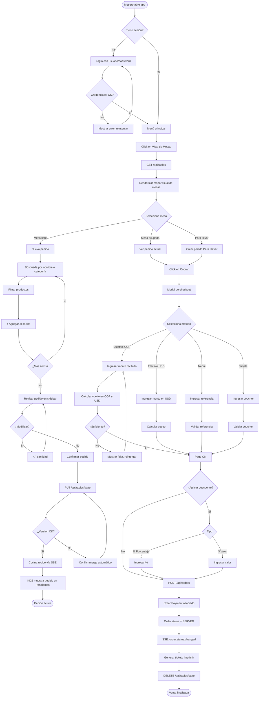
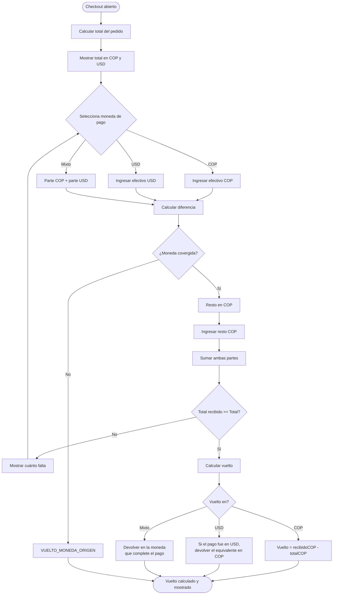
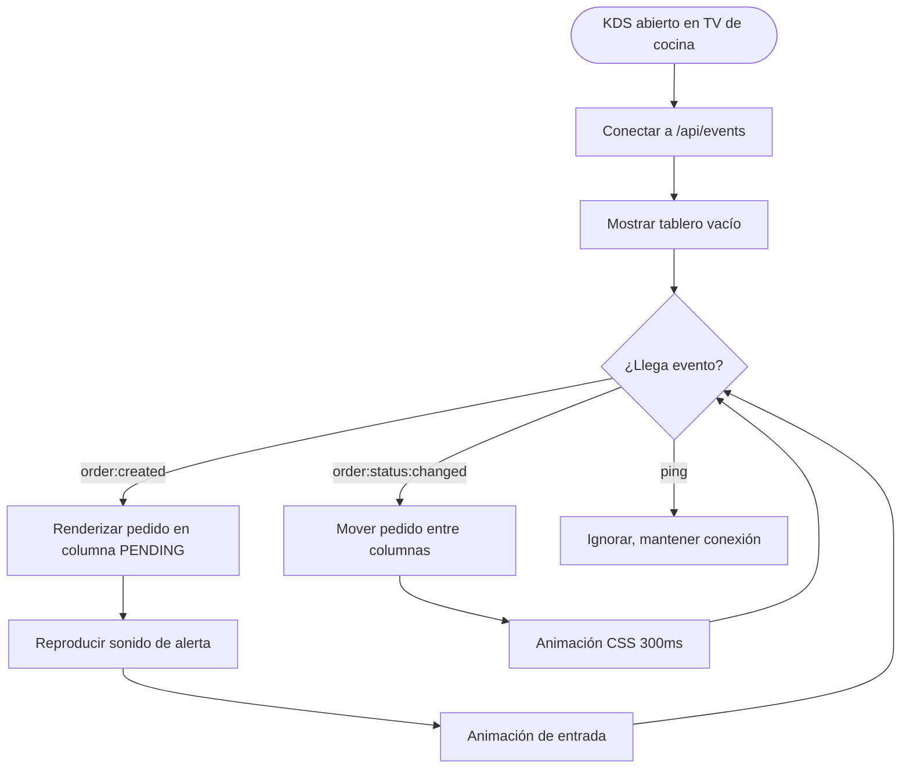
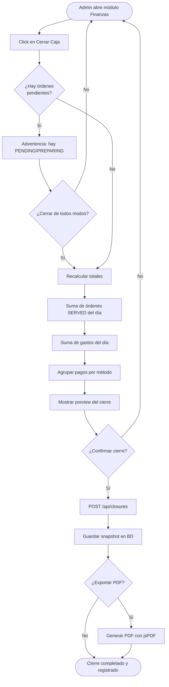
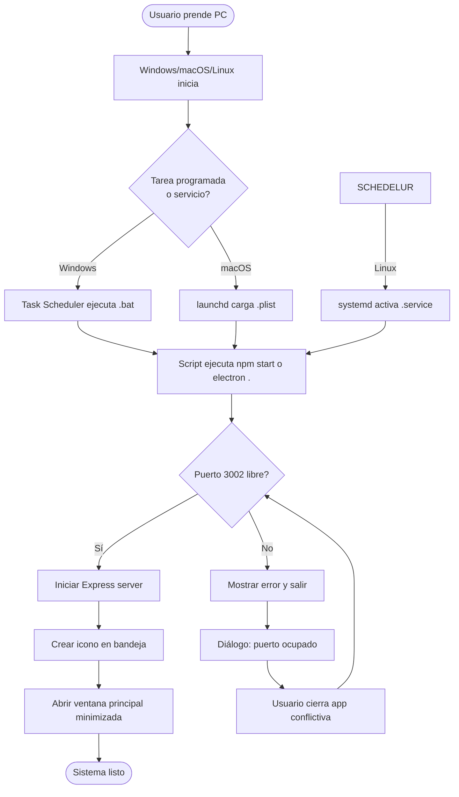
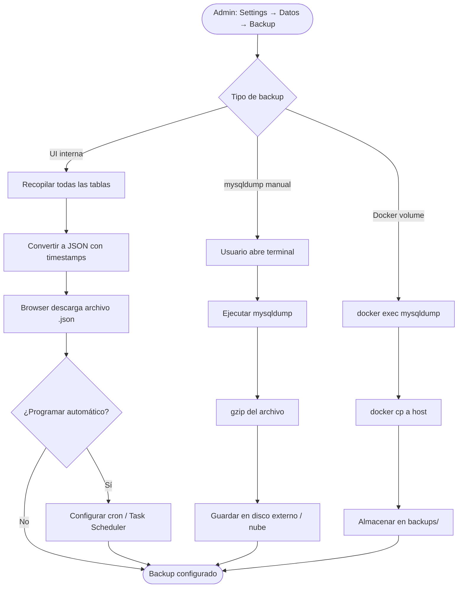

# 09 — Flujos de Negocio

Este capítulo documenta los procesos de negocio principales del sistema 2Arbolitos mediante diagramas de flujo detallados. Cada flujo representa una interacción real extraída de los componentes React y controladores del servidor.

## 9.1 Flujo del Punto de Venta (POS)



## 9.2 Flujo de Pago Multi-Moneda



**Ejemplo numérico:**

```
Tasa de cambio: 1 USD = 4200 COP
Total pedido:   50.000 COP  ≈ 11.90 USD

Cliente paga con:
  - 20 USD billete
  - Necesita completar 50.000 - (20 * 4200) = -34.000 → ya cubre todo

Vuelto: 20 USD * 4200 - 50.000 = 34.000 COP
        (se devuelve en pesos aunque pagó en dólares)
```

## 9.3 Flujo de Sincronización con Resolución de Conflictos

Este es el flujo más crítico del sistema. Garantiza que dos meseros editando la misma mesa simultáneamente **no pierdan datos**.

```mermaid
flowchart TD
    INICIO([Mesero modifica carrito]) --> LOCAL_UPDATE[Actualizar activeTables local]
    LOCAL_UPDATE --> LS[Persistir en localStorage]
    LS --> DEBOUNCE[Esperar 300ms debounce]

    DEBOUNCE --> REQUEST[PUT /api/tables/state<br/>{tableId, items, _clientVersion: 5}]

    REQUEST --> SERVER_VALIDATE{Servidor válida}
    SERVER_VALIDATE -->|versión=5, no conflicto| UPDATE_OK[UPDATE versión=6]
    SERVER_VALIDATE -->|serverVersion=6 > 5| CONFLICT[Detectar conflicto]

    UPDATE_OK --> NOTIFY_SSE[SSE broadcast: table:updated]
    NOTIFY_SSE --> OTROS_CLIENTES[Otros clientes actualizan UI]
    OTROS_CLIENTES --> FIN_OK([Sync OK])

    CONFLICT --> RESP_409[Responder 409 Conflict<br/>{serverData, serverVersion: 6}]
    RESP_409 --> CLIENTE_MERGE[Cliente A hace merge]

    CLIENTE_MERGE --> MERGE_LOGIC{Lógica de merge}
    MERGE_LOGIC --> SERVER_DATA[Tomar serverData: A1, A2]
    SERVER_DATA --> AGREGAR_LOCAL[Agregar items locales únicos: B1, B2]
    AGREGAR_LOCAL --> RESULTADO[Array final: A1, A2, B1, B2]
    RESULTADO --> CLIENTE_UPDATE[setActiveTables con versión=6]
    CLIENTE_UPDATE --> REINTENTAR[Reintentar PUT con _clientVersion=6]
    REINTENTAR --> REQUEST

    style CONFLICT fill:#ffe4b5
    style MERGE_LOGIC fill:#b5d4ff
    style RESULTADO fill:#c5f0c5
```

### Reglas del Merge

1. **El estado del servidor es la verdad** para items existentes.
2. **Los items locales únicos se preservan** (evita pérdida de trabajo).
3. **Por product.id** (no por índice de array), evitando duplicados visuales.
4. **Cantidades se suman** si hay duplicados (estrategia conservadora).

```javascript
function mergeItems(serverData, localItems) {
  const merged = [...serverData];
  localItems.forEach(local => {
    const existing = merged.find(m => m.product.id === local.product.id);
    if (existing) {
      // Suma cantidades (estrategia aditiva)
      existing.quantity = Math.max(existing.quantity, local.quantity);
    } else {
      // Agrega items que el servidor no tiene
      merged.push(local);
    }
  });
  return merged;
}
```

## 9.4 Flujo de Cocina en Tiempo Real (KDS)



**Columnas del KDS:**

| Columna | Estado | Color de fondo | Acción |
|:--------|:-------|:---------------|:-------|
| 🟡 Pendientes | PENDING | Amarillo claro | Aceptar → PREPARING |
| 🟠 En Preparación | PREPARING | Naranja claro | Marcar listo → READY |
| 🟢 Listas | READY | Verde claro | Mesero retira |

## 9.5 Flujo de Cierre de Caja (Reporte Z)



**Estructura del Closure generado:**

```
┌──────────────────────────────────────┐
│  CIERRE DE CAJA - 03/06/2026         │
│  Tasa de cambio: 4200 COP/USD        │
├──────────────────────────────────────┤
│  ÓRDENES PROCESADAS:    47           │
│                                      │
│  VENTAS:                            │
│    Efectivo COP:      $ 520,000     │
│    Efectivo USD:      $   87.50     │
│    Nequi:             $ 180,000     │
│    Tarjeta:           $ 145,000     │
│  ─────────────────────────────       │
│  TOTAL COP:           $ 845,000     │
│  TOTAL USD:           $  87.50      │
│                                      │
│  GASTOS OPERATIVOS:                  │
│    Insumos:           $  22,000     │
│    Servicios:         $  10,000     │
│  ─────────────────────────────       │
│  TOTAL GASTOS:        $  32,000     │
│                                      │
│  NETO DEL DÍA:                      │
│    COP:               $ 813,000     │
│    USD:               $  87.50      │
│                                      │
│  NOTAS: Cierre turno noche           │
└──────────────────────────────────────┘
```

## 9.6 Flujo de Auto-Start (Inicio con el Sistema)



**Configuración del auto-start:**

- Se activa desde `Settings → Servidor → Inicio automático con el sistema`.
- El backend ejecuta `npx pm2-startup install` (Windows) o `npx pm2 startup` (Unix) en el primer arranque tras activarlo.
- Crea una tarea programada / launchd plist / systemd service que ejecuta `electron .` o `npm start`.

## 9.7 Flujo de Backup de Base de Datos



**Frecuencia recomendada:**

| Tipo | Frecuencia | Retención |
|:-----|:-----------|:----------|
| Completo (mysqldump) | Diario, 03:00 AM | 30 días |
| Incremental (binlog) | Cada 15 min | 7 días |
| Snapshot manual | Antes de actualizaciones | 5 versiones |

## 9.8 Conclusión

Los flujos de negocio presentados cubren las operaciones críticas de un restaurante:

1. **POS táctil** — desde login hasta ticket final.
2. **Pago multi-moneda** — incluyendo pagos mixtos y conversión COP↔USD.
3. **Sincronización robusta** — versionado optimista + conflict-merge.
4. **Cocina en tiempo real** — KDS reactivo vía SSE.
5. **Cierre de caja** — snapshot fiscal del día.
6. **Auto-start** — confiabilidad operacional.
7. **Backup** — preservación de datos.

Todos estos flujos están **implementados en el código actual** y pueden verificarse siguiendo los `file:line` citados en el manual técnico.
